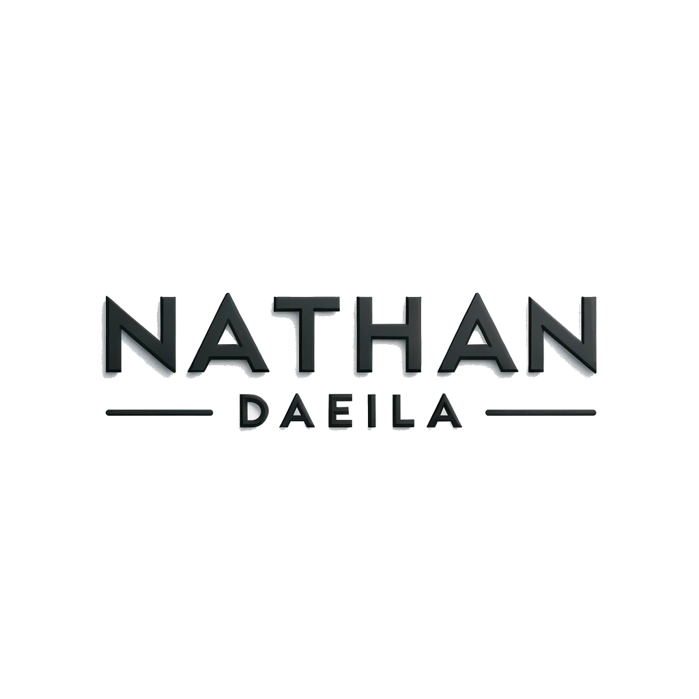

<a name="readme-top"></a>

<!-- PROJECT SHIELDS -->
<!--
*** I'm using markdown "reference style" links for readability.
*** Reference links are enclosed in brackets [ ] instead of parentheses ( ).
*** See the bottom of this document for the declaration of the reference variables
*** for contributors-url, forks-url, etc. This is an optional, concise syntax you may use.
*** https://www.markdownguide.org/basic-syntax/#reference-style-links
-->

[![LinkedIn][linkedin-shield]][linkedin-url]
---
[![Stargazers][stars-shield]][stars-url]
[![Issues][issues-shield]][issues-url]
[![MIT License][license-shield]][license-url]


<!-- PROJECT LOGO -->
<br />
<div align="center">
  <a href="https://github.com/ndaeila/Daeila-Website">
    
  </a>

<h3 align="center"><i>My Personal Blog</i><br>Nathan Bardia Daeila</h3>

  <p align="center">
    I planned on developing this blog for a while, as a way to share my projects, knowledge, and insight. I learned many things along the process and will share my findings in future articles.
    <br />
    <br />
    <a href="https://github.com/ndaeila/Daeila-Website"><strong>Explore the docs »</strong></a>
    <br />
    <br />
    <a href="https://github.com/ndaeila/Daeila-Website">View My Site</a><br>
    <a href="https://github.com/ndaeila/Daeila-Website/issues">Report Bug</a>
    ·
    <a href="https://github.com/ndaeila/Daeila-Website/issues">Request Feature</a>
  </p>
</div>


<!-- TABLE OF CONTENTS -->
<details>
  <summary>Table of Contents</summary>
  <ol>
    <li>
      <a href="#about-the-project">About The Project</a>
      <ul>
        <li><a href="#built-with">Built With</a></li>
      </ul>
    </li>
    <!--<li>
      <a href="#getting-started">Getting Started</a>
      <ul>
        <li><a href="#prerequisites">Prerequisites</a></li>
        <li><a href="#installation">Installation</a></li>
      </ul>
    </li>
    <li><a href="#usage">Usage</a></li>-->
    <li><a href="#roadmap">Roadmap</a></li>
    <li><a href="#contributing">Contributing</a></li>
    <li><a href="#license">License</a></li>
    <li><a href="#contact">Contact</a></li>
    <!--<li><a href="#acknowledgments">Acknowledgments</a></li>-->
  </ol>
</details>


<!-- ABOUT THE PROJECT -->
## About My Portfolio Blog

[![www.daeila.com Screen Shot][product-screenshot]](https://www.daeila.com)

<p align="right">(<a href="#readme-top">back to top</a>)</p>


### Built With

* [![GoLang][go.dev]][Golang-url]
* [![Bootstrap][Bootstrap.com]][Bootstrap-url]

And other services. 

<p align="right">(<a href="#readme-top">back to top</a>)</p>


<!-- The Project -->
## Introduction

If you would like to know more about why I created this project, please see the About section of my webpage:

[![About this Site][about-shield]][about-url]

<!-- ### Prerequisites

This is an example of how to list things you need to use the software and how to install them.
* npm
  ```sh
  npm install npm@latest -g
  ```

### Installation

1. Get a free API Key at [https://example.com](https://example.com)
2. Clone the repo
   ```sh
   git clone https://github.com/ndaeila/Daeila-Website.git
   ```
3. Install NPM packages
   ```sh
   npm install
   ```
4. Enter your API in `config.js`
   ```js
   const API_KEY = 'ENTER YOUR API';
   ```

<p align="right">(<a href="#readme-top">back to top</a>)</p>


USAGE EXAMPLES
## Usage

Are you wondering how to use my website or are you wondering how to repurpose my blog for your purposes?
If you meant the latter, figure it out yourself. You got this!

_For more examples, please refer to the [Documentation](https://example.com)_

<p align="right">(<a href="#readme-top">back to top</a>)</p>
-->


<!-- ROADMAP ☐ ☒ -->
## Roadmap

- ☒ Create a Blog with Markdown Articles
    - ☐ Refine UI elements
- ☐ Extra Features
    - ☐ Create a Network Architecture Diagram
        - Auto-Loading Network Diagram
        - Generated using POST Requests from servers to an API somewhere
        - Active/Inactive indicators for hardware
        - Timeout causes hardware entry to disappear after a certain timeframe
- ☐ DevOps Magic
    - ☐ **Auto-Export Static Files to CDN scripts for multiple CDN Providers** perhaps as GitHub Action


See the [open issues](https://github.com/ndaeila/Daeila-Website/issues) for a full list of proposed features (and known issues).

<p align="right">(<a href="#readme-top">back to top</a>)</p>


<!-- CONTRIBUTING -->
## Contributing

Contributions are the heartbeat of the open source community, making it a vibrant hub for learning, inspiration, and innovation. Your contributions are immensely valued and appreciated. 🌟

Got a cool idea to enhance this project? Here's how you can make it happen:

- Fork the Project: Find your way to the project's page and hit that `fork` button! 🍴
- Create Your Feature Branch: Fire up your terminal and switch to a new branch with `git checkout -b feature/YourCoolFeature`.
- Commit Your Changes: Make your magic happen, then commit it with `git commit -m 'New: YourCoolFeature'`.
- Push to Your Branch: Send your awesome work out into the world with `git push origin feature/YourCoolFeature`.
- Open a Pull Request: Go to the original repo and open a pull request 🚀

And hey, don't forget to star the project if you love it! Your support means a lot. ✨ Thanks a bunch!

<p align="right">(<a href="#readme-top">back to top</a>)</p>


<!-- LICENSE -->
## License

Distributed under the MIT License. See `LICENSE.txt` for more information.

But if the license isn't clear enough, feel free to use my code for whatever. But please don't reuse my media and articles. Thank you. 

<p align="right">(<a href="#readme-top">back to top</a>)</p>


<!-- CONTACT -->
## Contact

Nathan Daeila - ndaeila@uw.edu - nathanbdaeila@gmail.com

Project Link: [https://github.com/ndaeila/Daeila-Website](https://github.com/ndaeila/Daeila-Website)

<p align="right">(<a href="#readme-top">back to top</a>)</p>


<!-- ACKNOWLEDGMENTS -->
<!-- ## Acknowledgments

* []()
* []()
* []()

-->

<p align="right">(<a href="#readme-top">back to top</a>)</p>


<!-- MARKDOWN LINKS & IMAGES -->
<!-- https://www.markdownguide.org/basic-syntax/#reference-style-links -->
[contributors-shield]: https://img.shields.io/github/contributors/ndaeila/Daeila-Website.svg?style=for-the-badge
[contributors-url]: https://github.com/ndaeila/Daeila-Website/graphs/contributors
[forks-shield]: https://img.shields.io/github/forks/ndaeila/Daeila-Website.svg?style=for-the-badge
[forks-url]: https://github.com/ndaeila/Daeila-Website/network/members
[stars-shield]: https://img.shields.io/github/stars/ndaeila/Daeila-Website.svg?style=for-the-badge
[stars-url]: https://github.com/ndaeila/Daeila-Website/stargazers
[issues-shield]: https://img.shields.io/github/issues/ndaeila/Daeila-Website.svg?style=for-the-badge
[issues-url]: https://github.com/ndaeila/Daeila-Website/issues
[license-shield]: https://img.shields.io/github/license/ndaeila/Daeila-Website.svg?style=for-the-badge
[license-url]: https://github.com/ndaeila/Daeila-Website/blob/master/LICENSE.txt
[linkedin-shield]: https://img.shields.io/badge/-LinkedIn-black.svg?style=for-the-badge&logo=linkedin&colorB=555
[linkedin-url]: https://linkedin.com/in/nathan-daeila
[about-shield]: https://img.shields.io/badge/About_This_Blog-37a724?style=for-the-badge
[about-url]: https://www.daeila.com/blog/post-1/
[product-screenshot]: images/screenshot.jpg
[Next.js]: https://img.shields.io/badge/next.js-000000?style=for-the-badge&logo=nextdotjs&logoColor=white
[Next-url]: https://nextjs.org/
[React.js]: https://img.shields.io/badge/React-20232A?style=for-the-badge&logo=react&logoColor=61DAFB
[React-url]: https://reactjs.org/
[Vue.js]: https://img.shields.io/badge/Vue.js-35495E?style=for-the-badge&logo=vuedotjs&logoColor=4FC08D
[Vue-url]: https://vuejs.org/
[Angular.io]: https://img.shields.io/badge/Angular-DD0031?style=for-the-badge&logo=angular&logoColor=white
[Angular-url]: https://angular.io/
[Svelte.dev]: https://img.shields.io/badge/Svelte-4A4A55?style=for-the-badge&logo=svelte&logoColor=FF3E00
[Svelte-url]: https://svelte.dev/
[Laravel.com]: https://img.shields.io/badge/Laravel-FF2D20?style=for-the-badge&logo=laravel&logoColor=white
[Laravel-url]: https://laravel.com
[Bootstrap.com]: https://img.shields.io/badge/Bootstrap-563D7C?style=for-the-badge&logo=bootstrap&logoColor=white
[Bootstrap-url]: https://getbootstrap.com
[JQuery.com]: https://img.shields.io/badge/jQuery-0769AD?style=for-the-badge&logo=jquery&logoColor=white
[JQuery-url]: https://jquery.com 
[go.dev]: https://img.shields.io/badge/Go-00ADD8?style=for-the-badge&logo=go&logoColor=white
[Golang-url]: https://go.dev